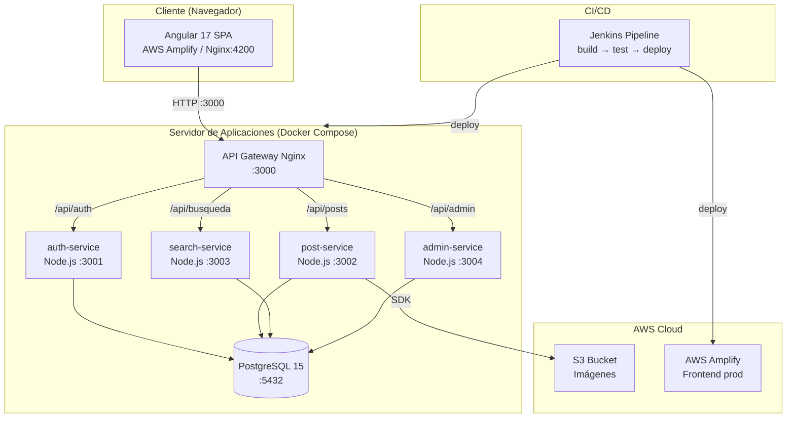

# Diagrama de Implementación — Hipstagram

## Descripción de nodos y artefactos

```
┌─────────────────────────────────────────────────────────────────────────────┐
│                          CLIENTE / NAVEGADOR                                │
│  ┌───────────────────────────────────────────────────────┐                  │
│  │  <<artifact>>  hipstagram-frontend (Angular 17 SPA)   │                  │
│  │  Servida por: AWS Amplify (producción)                │                  │
│  │             / Nginx:4200 (Docker local)               │                  │
│  └───────────────────────┬───────────────────────────────┘                  │
└──────────────────────────│──────────────────────────────────────────────────┘
                           │  HTTPS / HTTP :3000
                           ▼
┌─────────────────────────────────────────────────────────────────────────────┐
│                    SERVIDOR DE APLICACIONES  (Docker Compose / EC2)         │
│                                                                             │
│  ┌─────────────────────────────────────────────────────┐                   │
│  │  <<device>> API Gateway (Nginx)  — Puerto 3000       │                   │
│  │  Enruta según path:                                  │                   │
│  │   /api/auth/*    → auth-service:3001                │                   │
│  │   /api/posts/*   → post-service:3002                │                   │
│  │   /api/busqueda/*→ search-service:3003              │                   │
│  │   /api/admin/*   → admin-service:3004               │                   │
│  └──────┬──────────┬──────────┬──────────┬────────────┘                   │
│         │          │          │          │                                  │
│    ┌────▼───┐ ┌────▼───┐ ┌───▼────┐ ┌───▼────┐                            │
│    │ auth   │ │ post   │ │ search │ │ admin  │  ← Microservicios Node.js  │
│    │ :3001  │ │ :3002  │ │ :3003  │ │ :3004  │    (Express + TypeScript)  │
│    └────┬───┘ └────┬───┘ └───┬────┘ └───┬────┘                            │
│         │          │         │           │                                  │
│         └──────────┴─────────┴───────────┘                                 │
│                             │                                               │
│              ┌──────────────▼──────────────┐                               │
│              │  <<device>> PostgreSQL 15    │                               │
│              │  hipstagram-db  Puerto 5432  │                               │
│              │  Volumen: postgres_data      │                               │
│              └─────────────────────────────┘                               │
└─────────────────────────────────────────────────────────────────────────────┘
                           │  SDK / S3 API
                           ▼
┌─────────────────────────────────────────────────────────────────────────────┐
│                        AWS CLOUD                                             │
│                                                                             │
│  ┌──────────────────────┐      ┌──────────────────────┐                    │
│  │  <<artifact>>        │      │  <<artifact>>         │                    │
│  │  S3 Bucket           │      │  AWS Amplify          │                    │
│  │  Imágenes de posts   │      │  Frontend (producción)│                    │
│  └──────────────────────┘      └──────────────────────┘                    │
└─────────────────────────────────────────────────────────────────────────────┘

┌─────────────────────────────────────────────────────────────────────────────┐
│                        CI / CD  (Jenkins)                                   │
│  Pipeline: build → test → docker build → docker push → deploy               │
│  Jenkinsfile en raíz del repositorio                                        │
└─────────────────────────────────────────────────────────────────────────────┘
```

---

## Versión Mermaid (para GitHub / Notion / Confluence)



---

## Descripción de nodos

| Nodo | Tipo | Tecnología | Puerto |
|------|------|-----------|--------|
| Cliente (Navegador) | Device | Angular 17 | — |
| API Gateway | Device (contenedor) | Nginx | 3000 |
| auth-service | Execution Environment | Node.js + Express + TS | 3001 |
| post-service | Execution Environment | Node.js + Express + TS | 3002 |
| search-service | Execution Environment | Node.js + Express + TS | 3003 |
| admin-service | Execution Environment | Node.js + Express + TS | 3004 |
| PostgreSQL 15 | Device (contenedor) | PostgreSQL | 5432 |
| S3 Bucket | Execution Environment | AWS S3 | — |
| AWS Amplify | Execution Environment | AWS Amplify | HTTPS |
| Jenkins | Execution Environment | Jenkins | — |

## Artefactos desplegados

| Artefacto | Nodo destino |
|-----------|-------------|
| `hipstagram-frontend` (dist Angular) | AWS Amplify / Nginx |
| `hipstagram-auth-service` (Docker image) | auth-service |
| `hipstagram-post-service` (Docker image) | post-service |
| `hipstagram-search-service` (Docker image) | search-service |
| `hipstagram-admin-service` (Docker image) | admin-service |
| `init.sql` | PostgreSQL (inicialización) |
| Archivos de imagen | S3 Bucket |
